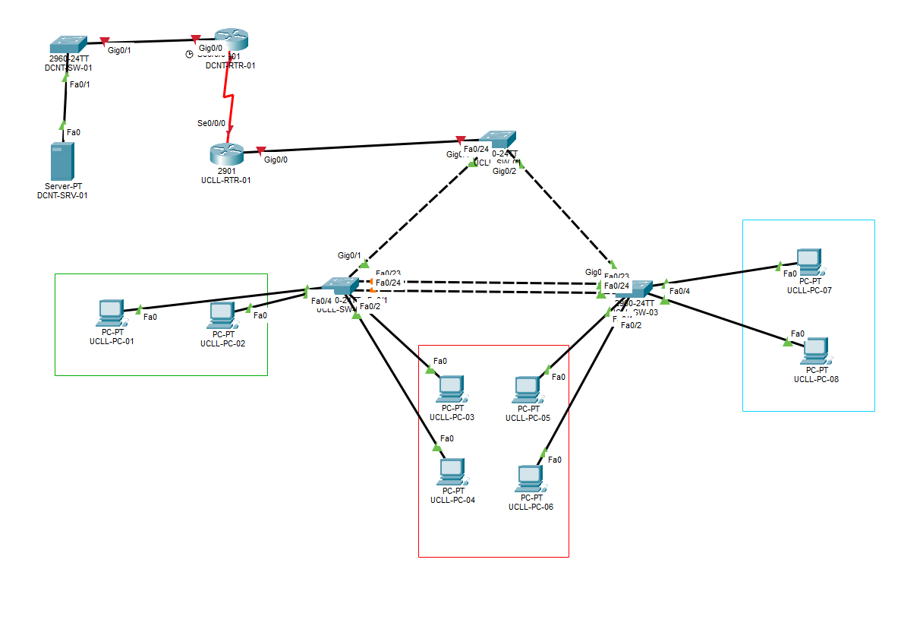

# Overzicht adressen

| Device name   | Port      | IP                               |
|---------------|-----------|-----------------------------------|
| UCLL-RTR-01   | VLAN 10   | 172.16.255.254/16                 |
|               |           | 2001:ACAD:DB8:10::1/64            |
|               |           | FE80::1                           |
| UCLL-RTR-01   | VLAN 20   | 172.17.255.254/16                 |
|               |           | 2001:ACAD:DB8:20::1/64            |
|               |           | FE80::1                           |
| UCLL-RTR-01   | VLAN 30   | 172.18.255.254/16                 |
| UCLL-RTR-01   | Se0/0/0   | 1.1.1.2/8                         |
| UCLL-RTR-01   | Se0/0/1   | 2.2.2.2/8                         |
| DCNT-RTR-01   | Se0/0/0   | 1.1.1.1/8                         |
| DCNT-RTR-01   | Gig0/0    | 10.0.1.254/24                     |
| DCNT-SRV-01   | Fa0       | 10.0.1.5 (al geconfigureerd, ter info: DNS & DHCP server) |

---

# VLAN’s

In het UCLL-netwerk bestaan 3 VLAN’s:

- VLAN 10: Studenten  
- VLAN 20: Lectoren  
- VLAN 30: Researchers  

Maak deze VLAN’s overal waar nodig aan.

Zorg dat de PC’s van de studenten (groene kader) in VLAN 10 geplaatst worden, de PC’s van de lectoren (rode kader) in VLAN 20 en de PC’s van de researchers (blauwe kader) in VLAN 30.

Configureer alle links juist, zodat inter-VLAN routing mogelijk is.

---

# DHCP

Uiteraard willen we graag dat de PC’s in het UCLL-netwerk hun netwerkadressen automatisch toebedeeld krijgen. Hiervoor configureren we DHCP.

## Studenten DHCP

Voor het Studenten-netwerk maak je een pool met de naam **VLAN10_POOL**.  
Alle bruikbare adressen mogen uitgedeeld worden.  
Geef ook info mee over de route en DNS-server.  
Ook voor IPv6 dient een stateless DHCP-server geconfigureerd te worden.  
De pool noem je **VLAN10_POOL_IPV6**.

## Lectoren DHCP

Voor het Lectoren-netwerk maak je een pool met de naam **VLAN20_POOL**.  
De adressen **172.17.0.1–172.17.9.255** zijn gereserveerd voor statische configuraties en mogen niet mee uitgedeeld worden.  
Alle andere bruikbare adressen mogen uitgedeeld worden.  
Geef ook info mee over de router en DNS-server.

Voor IPv6 maken de PC’s gebruik van **SLAAC**. Configureer hiervoor het nodige.

## Researchers DHCP

Zorg ervoor dat alle DHCP-requests op dit netwerk doorgestuurd worden naar de server in het datacenter-netwerk.  
Hier is de nodige configuratie al gebeurd.

---

# OSPF

Tussen UCLL en het datacenter dienen dynamisch routes uitgewisseld te worden.  
Maak gebruik van **OSPF ID 10** om op alle nodige routers OSPF te configureren.

Zorg ervoor dat OSPF enkel tussen de routers uitgewisseld wordt, en dat er geen OSPF-verkeer op de LAN-netwerken terecht komt.  
Maak gebruik van **network statements** in het router OSPF menu.

---

# NAT

Configureer NAT op **UCLL-RTR-01** zodat de 3 LAN-netwerken (VLAN 10, VLAN 20 en VLAN 30) toegang hebben tot het internet via het publieke IP-adres van interface **Se0/0/0**.

1. Maak een ACL aan die de 3 LAN-netwerken toelaat: definieer een standaard ACL (nummer 1 via `ip access-list` commando) die de subnets voor de VLAN-netwerken toelaat.  
2. Markeer de inside en outside interfaces.  
3. Activeer PAT (overload): koppel de ACL aan de outside-interface Se0/0/0 met het overload-keyword, zodat alle 3 LAN-netwerken vertaald worden naar het IP-adres van Se0/0/0 (1.1.1.2).

---

# Etherchannel

Om het netwerk in het datacenter optimaal te gebruiken, dient in het datacenter een etherchannel-link geconfigureerd te worden tussen **UCLL-SW-02** en **UCLL-SW-03**, op poorten **fastEthernet 0/23 en 0/24**.  
Maak gebruik van **channel-ID 1** en **actieve modus**.





# Oplossing

## VLANs Configureren

### UCLL-RTR-01

1. Router>```enable```
2. Router#```conf t```

#### Subinterfaces (inter-VLAN routing)

3. UCLL-RTR-01(config)#```interface g0/0/0.10```
4. UCLL-RTR-01(config-subif)#```encapsulation dot1Q 10```
5. UCLL-RTR-01(config-subif)#```ip address 172.16.255.254 255.255.0.0```
6. UCLL-RTR-01(config-subif)#```ipv6 address 2001:ACAD:DB8:10::1/64```
7. UCLL-RTR-01(config-subif)#```ipv6 address FE80::1 link-local```

8. UCLL-RTR-01(config)#```interface g0/0/0.20```
9. UCLL-RTR-01(config-subif)#```encapsulation dot1Q 20```
10. UCLL-RTR-01(config-subif)#```ip address 172.17.255.254 255.255.0.0```
11. UCLL-RTR-01(config-subif)#```ipv6 address 2001:ACAD:DB8:20::1/64```
12. UCLL-RTR-01(config-subif)#```ipv6 address FE80::1 link-local```

13. UCLL-RTR-01(config)#```interface g0/0/0.30```
14. UCLL-RTR-01(config-subif)#```encapsulation dot1Q 30```
15. UCLL-RTR-01(config-subif)#```ip address 172.18.255.254 255.255.0.0```

#### Interface G0/0/0 activeren

16. UCLL-RTR-01(config)#```interface g0/0/0```
17. UCLL-RTR-01(config-if)#```no shutdown```

#### Serial Interfaces

18. UCLL-RTR-01(config)#```interface se0/0/0```
19. UCLL-RTR-01(config-if)#```ip address 1.1.1.2 255.0.0.0```
20. UCLL-RTR-01(config-if)#```no shutdown```

21. UCLL-RTR-01(config)#```interface se0/0/1```
22. UCLL-RTR-01(config-if)#```ip address 2.2.2.2 255.0.0.0```
23. UCLL-RTR-01(config-if)#```no shutdown```

---

### DCNT-RTR-01

1. Router>```enable```
2. Router#```conf t```

#### Interface Serial0/0/0

3. DCNT-RTR-01(config)#```interface se0/0/0```
4. DCNT-RTR-01(config-if)#```ip address 1.1.1.1 255.0.0.0```
5. DCNT-RTR-01(config-if)#```no shutdown```

#### Interface Gigabit Ethernet 0/0

6. DCNT-RTR-01(config)#```interface g0/0```
7. DCNT-RTR-01(config-if)#```ip address 10.0.1.254 255.255.255.0```
8. DCNT-RTR-01(config-if)#```no shutdown```

---

### Switches (VLAN-aanmaak op alle nodige switches)

1. Switch>```enable```
2. Switch#```conf t```

#### VLANs aanmaken

3. Switch(config)#```vlan 10```
4. Switch(config-vlan)#```name Studenten```
5. Switch(config)#```vlan 20```
6. Switch(config-vlan)#```name Lectoren```
7. Switch(config)#```vlan 30```
8. Switch(config-vlan)#```name Researchers```

#### Access-poorten toewijzen aan VLANs

9. Switch(config)#```interface range f0/1-22```
10. Switch(config-if-range)#```switchport mode access```
11. Switch(config-if-range)#```switchport access vlan 10```

12. Switch(config)#```interface range f0/1-22```
13. Switch(config-if-range)#```switchport access vlan 10```

*Herhaal dit voor VLAN 20 en 30 op de respectievelijke poorten*

#### Trunk-poorten configureren

14. Switch(config)#```interface g0/1```
15. Switch(config-if)#```switchport mode trunk```
16. Switch(config-if)#```switchport trunk allowed vlan 10,20,30```